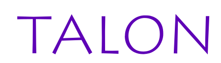

**static site management system**

---

Talon allows you to have multiple static pages displayed on your website
with a convenient menu to switch between them.

Talon can be used for a lot of different purposes:

- Creating a personal website
- Documentation for different projects
- Fast website publishing for testing
- Serving CI artifacts (Website previews, coverage reports)

## Models

### Site mark

- Mark
- Name
- Logo
- Color + 3 characters as logo alternative
- **OPT:** Time to live
- Number of kept versions
- Visibility: Featured/Searchable/Hidden
- List of versions

### Site version

- Version number
- Upload date
- Map of file URIs with their hashes (see File Storage)

### User

- Username
- Password

### API user

- API Key
- Creator (User)

### Access permissions

(for users and API users)

- Is admin
- Allowed marks/markspaces

  **Examples:**
  - Any mark including submarks: `#`
  - Any mark/submark under "ThetaDev": `thetadev.#`
  - Submark "Coverage" under any mark: `*.coverage`
  - Submark "Coverage" under the marks "thetadev" and "
    zoey": `thetadev|zoey.coverage`
  - Marks "thetadev.test" and "zoey.coverage": `thetadev.test||zoey.coverage`

- Max size per uploaded website
- Can create marks
- **OPT:** Max TTL for created marks
- Max versions for created marks
- Max visibility for created marks

### URL format

**Hash:**
example.com/h/7a9745fed498f69c46a3ffa5dfaff872e0e1df89

**Mark:**
example.com/thetadev/coverage/main-a352c312 example.com/thetadev/coverage/pr-3

## File storage

Files are stored with their SHA256 hashes to provide deduplication. If you
upload a lot of sites that use the same template, the stylesheets and scripts
only need to be stored once. The real filenames and folder structure are kept
in the database.

`storage/d/d41d8cd98f00b204e9800998ecf8427e`

Every day Talon should run a pruning operation where it will look for unused
files and delete them to free storage space.

## Logo

The font used is called Litmus and it was created by Alan Carr
(Download: https://www.ffonts.net/Litmus.font).

The *_inkscape.svg files are the ones to be edited. After editing, save
the files as *Optimized SVG* and turn off pretty-printing to get
browser-friendly SVG.
